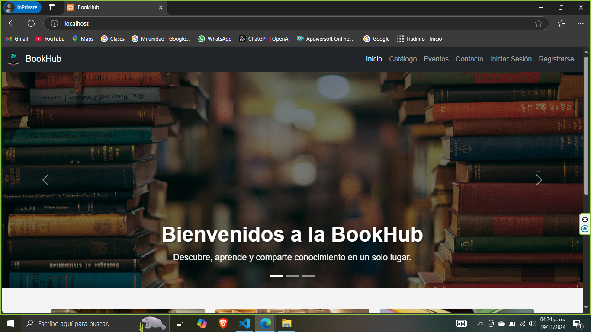
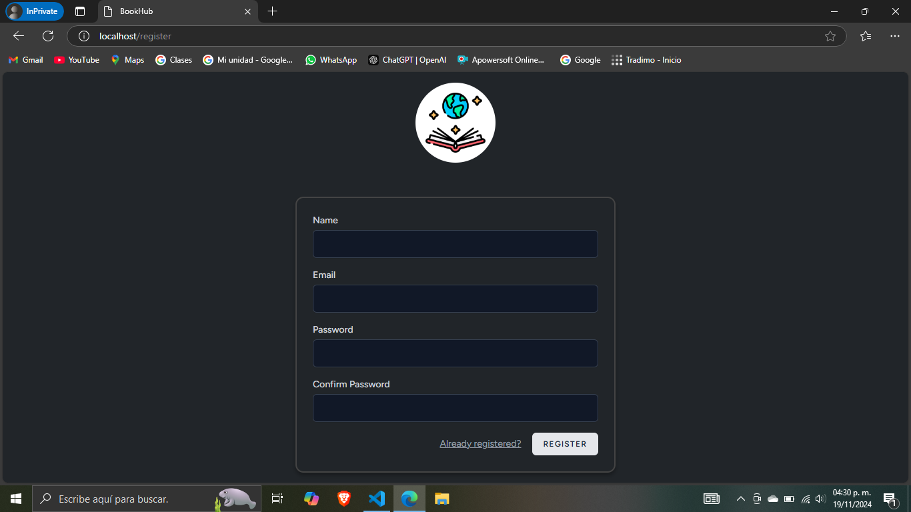
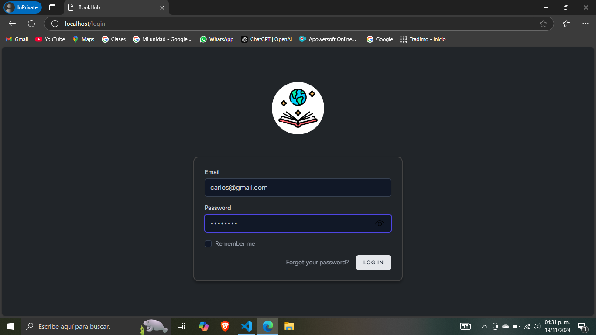
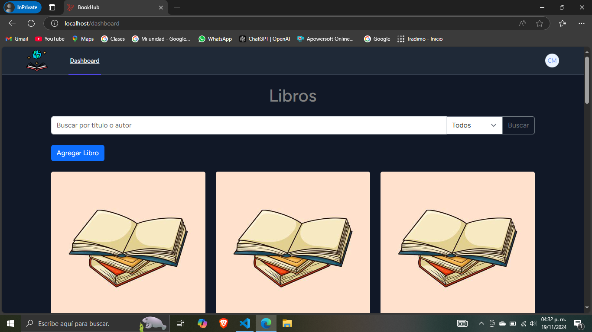
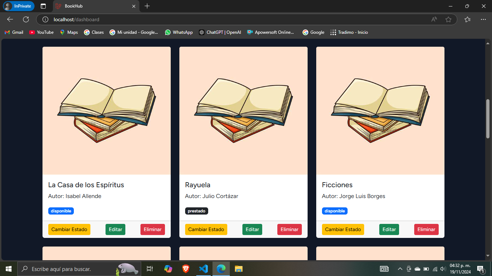
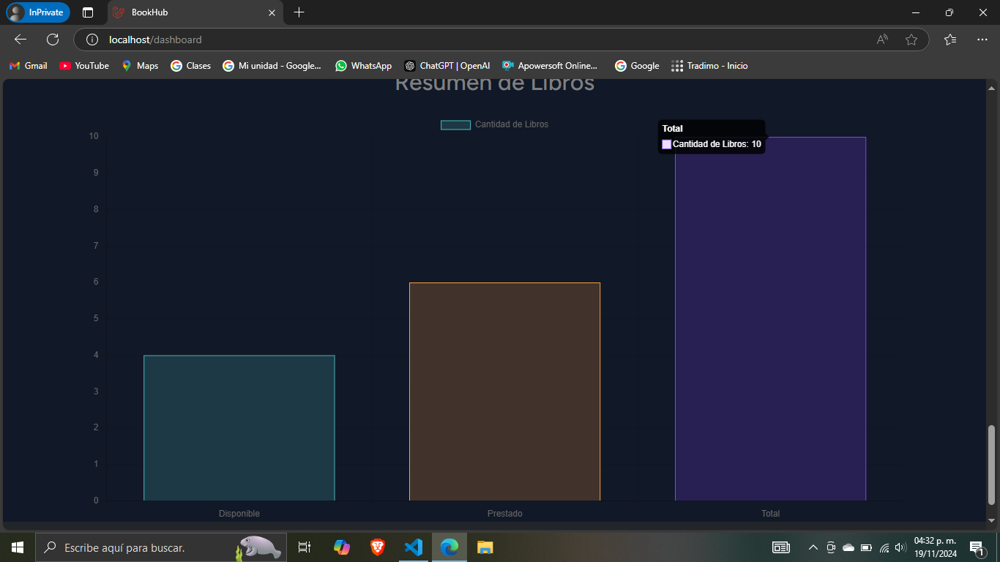

# BookHub: Sistema de Biblioteca con Jetstream

**BookHub** es un proyecto desarrollado con **Laravel Jetstream** que implementa un sistema  de gestión de una biblioteca. Este sistema permite la administración de libros, la autenticación de usuarios y una variedad de funcionalidades para gestionar los libros disponibles y prestados.

## Características

- **Página de Inicio (Home):** Bienvenida para los usuarios con acceso al sistema.
- **Autenticación de Usuarios:** Registro de nuevos usuarios e inicio de sesión seguro.
- **Dashboard:** Al iniciar sesión, los usuarios acceden a un panel donde pueden:
  - Ver un listado completo de libros.
  - Eliminar, actualizar o modificar los detalles de los libros.
  - Cambiar el estado de los libros entre **disponible** y **prestado**.
  - Realizar búsquedas de libros por **autor** y **título**.
  - Filtrar libros por su **estado**: disponibles o prestados.
  - Visualizar un **gráfico resumen** que muestra:
    - El total de libros en la biblioteca.
    - Cuántos están **prestados**.
    - Cuántos están **disponibles**.

## Tecnologías Utilizadas

- **Laravel Jetstream:** Framework para el desarrollo de aplicaciones web.
- **PHP:** Lenguaje principal del backend.
- **MySQL:** Base de datos para almacenar los libros y la información de los usuarios.
- **Tailwind y Bootstrap CSS:** Para los estilos y la interfaz de usuario.

## Requisitos

Para poder ejecutar este proyecto correctamente, necesitarás tener instaladas las siguientes herramientas:

- **XAMPP:** Un servidor local que incluye Apache y MySQL, necesario para ejecutar Laravel y gestionar la base de datos. [Descargar XAMPP](https://www.apachefriends.org/es/index.html)
- **Composer:** Herramienta de gestión de dependencias para PHP. [Descargar Composer](https://getcomposer.org/)
- **Node.js:** Necesario para instalar dependencias de frontend y ejecutar scripts de compilación. [Descargar Node.js](https://nodejs.org/)
- **Visual Studio Code:** Un editor de código recomendado para trabajar con PHP y Laravel. [Descargar Visual Studio Code](https://code.visualstudio.com/)

## Instalación

1. Clona este repositorio en tu máquina local en la ruta "C:\xampp\htdocs":

   ```bash
   https://github.com/Enethel110/BookHub.git

2. Accede a la carpeta del proyecto:

   cd BookHub

3. Instala las dependencias con **Composer**:

   composer install

4. Instalar las dependencias de Node.js

   npm install

5. Configura tu archivo `.env` con las credenciales de tu base de datos.
   
   cp .env.example .env

6. Generar la clave de la aplicación
   
   php artisan key:generate

7. Ejecuta las migraciones para crear las tablas necesarias:

   php artisan migrate

8. Inicia el servidor de desarrollo:

   php artisan server

9. Accede a la aplicación en `http://localhost:80`.

## License

The Laravel framework is open-sourced software licensed under the [MIT license](https://opensource.org/licenses/MIT).
## Página Home


## Register


## Login


## Dashboard de libros


## Libros


## Tabla resumen de libros

